# 1、特性描述
​	在智能运维中，故障管理作为最重要的一环，其作用不言而喻。整个故障管理智能化流程分故障发现、故障告警、故障恢复。

​	故障发现包含了异常检测、故障诊断等方面，主要目标是能够及时地发现并定位故障。其作为最开始的一环，效率及精度显得尤为重要，尤其在当前海量指标场景下，快速异常发现以及如何针对业务场景应用合适的检测策略的需求甚为迫切。在这种场景下，常规的阈值检测算法由于其需要人工配置及极大地依赖于人工经验，已经不再适用。因此A-Ops提供了智能检测框架，其内置了若干智能算法，如单指标检测算法、预处理算法、故障定位算法、指标分类算法等，并支持算法的导入及训练；同时考虑到有不同的业务场景，结合应用编排、场景识别、算法模型推荐功能，用户能够基于该框架快速地编排出适合不同场景的应用模型。

​	故障告警包含了告警事件的收敛、抑制及确认等，主要目标是降噪和发送告警。当故障发现后，往往伴随着故障事件风暴，因此需要做到完成告警事件的聚合以及过滤掉不必要的告警。同时其有误报反馈的功能，即能通过用户确认故障误报后生产误报样本，同时反馈优化算法模型，使得算法实时优化训练，进一步提升故障发现的精度。

​	故障恢复包含了故障修复、流量切换等，主要目标是及时修复故障，减少业务损失。

## 1.1、依赖组件
| 组件 | 组件描述 | 可获得性 |
| :--- | :------- | :------- |
|      |          |          |
|      |          |          |

## 1.2、License

# 2、需求场景分析

## 2.1、上下文/USE-CASE视图


异常检测按照特性功能，总共涉及以下几种场景：算法导入，算法训练，应用编排，工作流配置，故障诊断，故障告警。

### 2.1.1、算法导入Use Case

该场景主要为算法的管理流程，从算法的开发到导入。该特性需要依赖于算法来进行检测和诊断，现在的算法日新月异，因此需要提供一个算法的导入接口，可以方便开发人员快速地导入算法。算法的开发主要包括数据分类、场景识别、故障诊断、预处理、多指标检测、单指标检测算法。算法开发完成后需考虑算法的前端导入以及后端存储，最终是算法的查询。


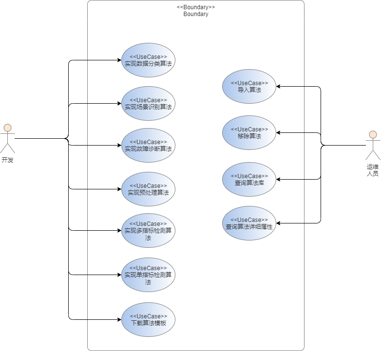

### 2.1.2、算法训练Use Case

该场景主要为算法的训练流程，从训练样本的选择到算法的选择，再到训练任务的创建以及训练结果的查看。目前的智能算法往往需要在样本集下进行一定轮次的迭代训练，并且需要根据训练结果不断优化更新超参数，最终才能得到效果良好的模型供检测使用。因此该特性需要提供算法训练的可视化入口，方便用户快速地训练得到适合自己业务场景的模型。

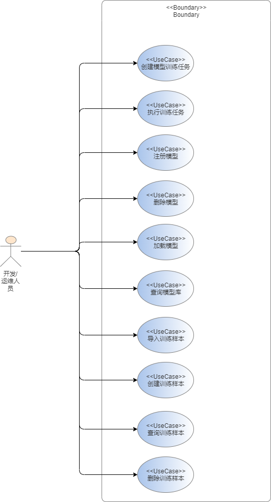

### 2.1.3、应用编排Use Case

要完成一个诊断，一个简单的模型往往是不够的，比如完成一次诊断需要先进行数据的预处理，单指标的异常检测，多指标的异常检测判断，到相关性的分析、因果分析，我们称之为应用。因此该特性提供一个应用编排的功能，方便用户根据自己的业务场景特点编排出自己的应用。

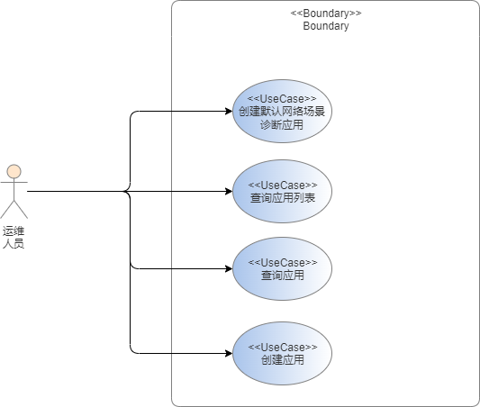

### 2.1.4、工作流配置Use Case
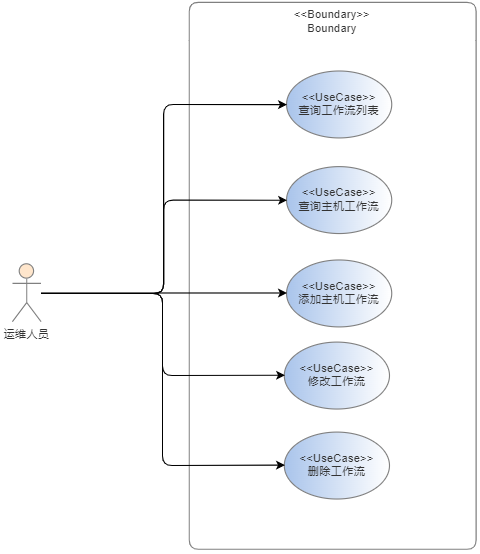

### 2.1.5、故障诊断Use Case
故障诊断提供两种模式：
- 模式一

该模式前置条件为集成在A-Ops框架下，在该框架下运维人员能够根据自己的业务场景训练算法，编排应用，创建诊断工作流，随后启动工作流，后台即会根据工作流中的步骤开始进行定时的检测与诊断。当用户选择停止执行工作流，异常诊断动作即会停止。
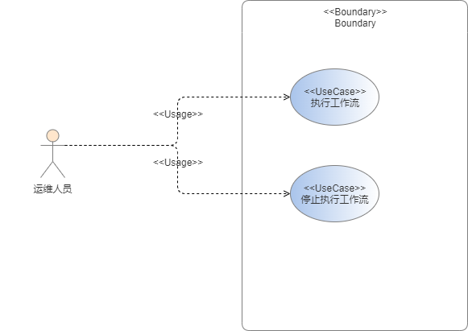
- 模式二

该模式下，故障诊断提供了纯粹的诊断能力，执行定时检测的任务，定时从prometheus获取数据，根据配置文件指定的场景，执行相应的默认诊断工作流，检测结果发送到kafka。


### 2.1.6、故障告警Use Case
故障告警的场景用于给用户提供告警规则配置功能、告警查看与管理功能、告警确认。用户可以查看告警的列表，每一条告警的详情。可以进行告警确认，判定故障诊断产生的结果是否为误报。另外可以配置告警上报的规则，如上报短信或邮件到相关的运维人员或群组。同时可以配置告警抑制规则，按照告警类型以及优先级对进行限制。

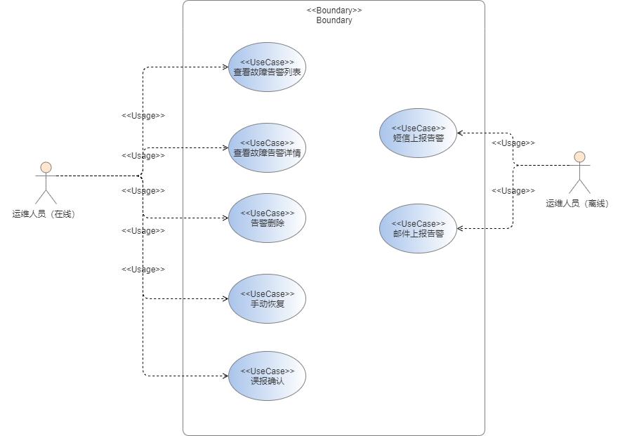


## 2.2、Story分解


| Use  Case   | Story            | 模块     |实现版本|
|-------- | ---------------- | -------- | ----- |
| 算法导入     | 实现数据分类算法   | 实验管理 | 22.09|
|             | 实现场景识别算法 | 实验管理 | 22.09|
|             | 实现故障诊断算法 | 实验管理 | 22.09|
|             | 实现预处理算法 | 实验管理 | 22.09|
|             | 实现多指标检测算法 | 实验管理 | 22.09|
|             | 实现单指标检测算法 | 实验管理 | 22.09|
|             | 导入算法 | 实验管理 ||
|             | 移除算法 | 实验管理 ||
|             | 查询算法库 | 实验管理 |  22.09|
|  | 查询算法详细属性 | 实验管理 | 22.09|
|             | 下载算法模板 | 实验管理 ||
| 算法训练 | 创建模型训练任务 | 实验管理 ||
|             | 执行训练任务 | 实验管理 ||
|             | 查询训练任务列表 | 实验管理 ||
|             | 查询训练任务详情 | 实验管理 ||
|             | 删除训练任务 | 实验管理 ||
|             | 注册模型 | 实验管理 ||
|             | 删除模型 | 实验管理 ||
|             | 加载模型         | 实验管理 | 22.09|
|             | 查询模型库 | 实验管理 | 22.09|
|             | 导入训练样本 | 实验管理 ||
|             | 创建训练样本 | 实验管理 ||
|             | 删除训练样本 | 实验管理 ||
|             | 查询训练样本 | 实验管理 ||
| 应用编排 | 创建默认网络场景诊断应用 | 实验管理 | 22.09|
|             | 查询应用列表 | 实验管理 | 22.09|
|             | 查询应用 | 实验管理 | 22.09|
|             | 创建应用 | 实验管理 ||
| 故障诊断 | 场景识别   |规则管理| 22.09|
|            | 推荐算法 |规则管理| 22.09|
|            | 创建工作流 |规则管理| 22.09|
|            | 删除工作流 |规则管理| 22.09|
|            | 修改工作流 |规则管理| 22.09|
|            | 查询工作流 |规则管理| 22.09|
||查询原始数据|检测管理| 22.09|
||删除原始数据|检测管理||
||解析工作流|检测管理| 22.09|
||执行工作流|检测管理| 22.09|
||查询检测结果|检测管理| 22.09|
||删除检测结果|检测管理| 22.09|
||生成检测报告|检测管理| 22.09|
||查询检测报告|检测管理| 22.09|
||删除检测报告|检测管理| 22.09|
|故障告警|告警屏蔽|检测管理||
||告警抑制|检测管理||
||上报告警信息|检测管理||

# 3、模块设计


异常检测服务分为三个模块：规则管理模块、实验管理模块和检测管理模块。规则管理模块主要负责检测工作流的配置和推荐规则的配置；实验管理模块主要负责算法的管理，算法的训练和注册，应用模型的编排，数据样本的管理；检测模块主要负责检测工作流的执行、检测的动态调度。三个模块之间直接通过api调用进行交互，其交互关系如下图所示：

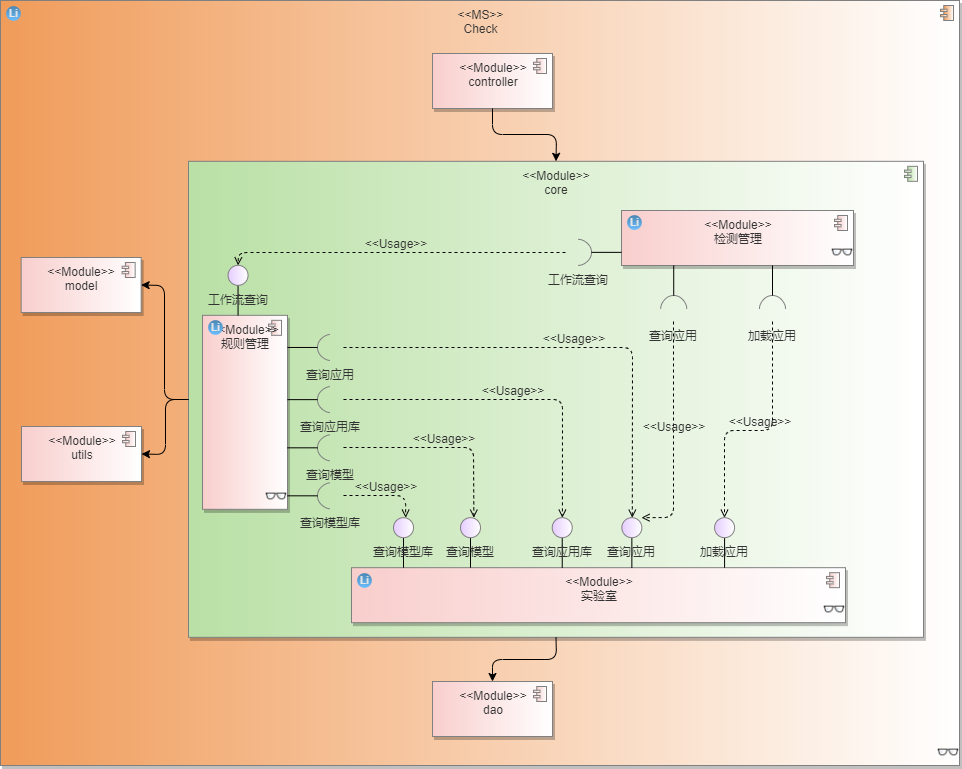

## 3.1、规则管理

### 3.1.1、功能实现

规则管理模块分为两个主要功能：工作流推荐与工作流管理。

**（1）工作流推荐**

- 算法推荐

    异常检测系统通过内置配置文件，定义场景与数据及算法的对应关系。用户在选中主机的应用后，可以通过主机的场景在前端界面选择如下内容进行部分或全部推荐：

    - 单指标检测：单指标检测项的算法推荐，以及个别采集项/采集探针的添加和删除
    - 多指标检测：多指标监测的算法推荐
    - 故障定位：故障定位的算法推荐

**（2）工作流管理**

- 工作流创建
工作流的结构如下所示：
```json
{
    "workflow_id": "",
    "workflow_name": "",
    "description": "",
    // 该诊断工作流需要的主机列表
    "input": {
        "domain_id": "",
        "hosts": []
    },
    // 检测步长
    "step": 5,
    // 检测周期
    "period": 10,
    // 工作流是否启动
    "enabled": true,
    // 告警相关设置，配置告警屏蔽、告警方式等
    "alert": {
    },
    // 选用的应用详情
    "app_info": {
        "id": "",
        "name": "",
        "version": "",
        "description": "",
        "api": {
            "type": "api",
            "address": ""
        },
        "detail": [
            {
                "name": "单指标检测",
                "enabled": true,
                "recommend": {
                    "enabled": true
                },
                "param": {
                    "default": {
                        "al_id": "",
                        "al_name": "",
                        "module_id": ""
                    }
                }
            },
            {
                "name": "多指标检测",
                "enabled": true,
                "recommend": {
                    "enabled": true
                },
                "param": {
                    "default": {
                        "al_id": "",
                        "al_name": "",
                        "module_id": ""
                    }
                }
            },
            {
                "name": "故障定位",
                "enabled": true,
                "recommend": {
                    "enabled": true
                },
                "param": {
                    "default": {
                        "al_id": "",
                        "al_name": "",
                        "module_id": ""
                    }
                }
            }
        ]
    }
}
```
主机的工作流确认后，后台将把工作流json文件存储在elasticsearch数据库中，并在mysql中把主机id与工作流id绑定。


- 工作流删除

主机删除工作流时，将mysql中主机的工作流信息删除，并删除elasticsearch中的工作流文件。

- 工作流修改

通过elasticsearch 的update方法，指定field进行文档的部分更新。

- 工作流查询

通过传入的主机id，在mysql中查询到对应的工作流id，进而从elasticsearch中查询到工作流doc。

### 3.1.2、UML图

### 3.1.3、Story分解

| Story      |说明|
| ---------- | ---------- |
| 场景识别   ||
| 推荐工作流 ||
| 增加工作流 ||
| 删除工作流 ||
| 修改工作流 ||
| 查询工作流 ||


## 3.2、实验管理

实验管理模块支撑了算法导入、算法训练、应用编排这三部分功能。

### 3.2.1、算法导入

#### 3.2.1.1、功能实现分析

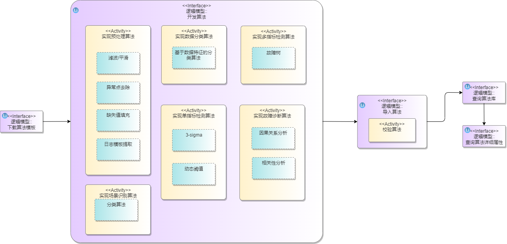

**（1）算法开发**

为保证算法的规范性，每个算法类继承自算法基类，后续实现的算法均需继承自相应的算法类。因此需要提供相应的算法模板，供开发者使用。目前算法主要分预处理算法、数据分类算法、场景识别算法、单指标检测算法、多指标监测算法、根因定位算法六个大类。

（a）预处理算法

| 类型       | 算法                  | 原理                                                         | 特点                                                         |
| --------------- | --------------------- | ------------------------------------------------------------ | ------------------------------------------------------------ |
| 滤波       | 中值滤波              | 取前段定长采样值，按大小排列，取中间值为本次有效值           | 能有效克服因偶然因素引起的波动(脉冲)干扰                     |
|            | 滑动平均滤波          | 取前段定长采样值的平均值为本次有效值                         | 适合对一般具有随机干扰的信号（即信号在某一数据范围附近上下波动）进行滤波 |
|            | 指数滑动平均滤波      | 本次滤波结果=(1-a)×本次采样值+a×上次滤波结果                 | 降低周期性的干扰                                             |
| 异常点去除 | 绝对中位值偏差（MAD） | 判断每一个元素与中位值的偏差是否处于合理的范围内来判断该元素是否为离群值，3-sigma为其特例 |                                                              |
| 缺失值处理 | 前值/后值/均值        | 将缺失值按照前面/后面/平均一个有效值进行填充                 |                                                              |
|            | 指定值                | 将缺失值按照输入的指定值进行填充                             |                                                              |

（b）数据分类算法

依据三种特征将指标分为不同的类别：平稳性，趋势性，周期性， 随后根据数据特征选择异常检测算法

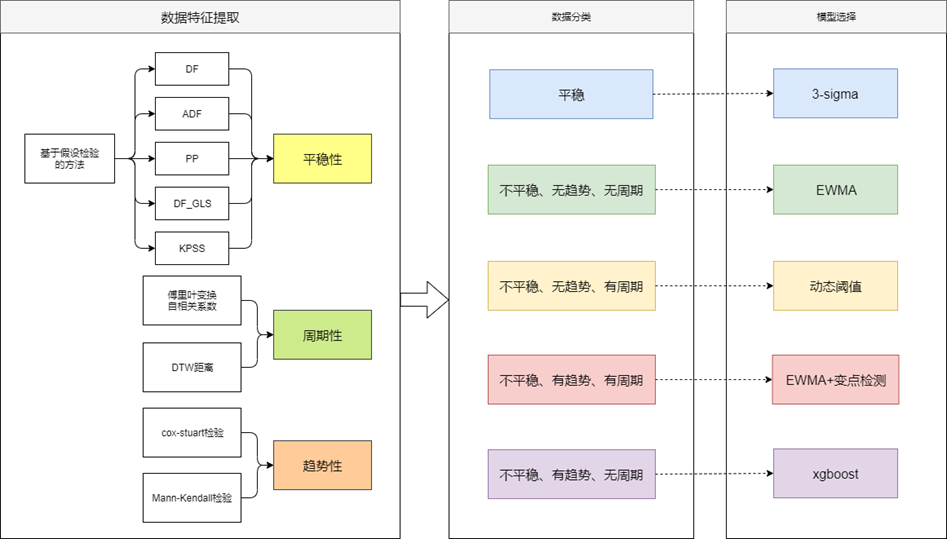

（c）场景识别算法

（d）单指标检测算法

（e）多指标检测算法

（f）根因定位算法

**（2）算法校验**

当算法导入时，需要先经过算法安全性校验、规范性校验，校验的条目如下所示。

- 安全性校验：

  - 无死循环

  - 无恶意占用资源

  - 无执行系统命令

  - 无读取系统信息

  - 无外界信息交互

- 规范性校验：

  - 当前无同名算法
  - 继承自规定的基类

  - 相应的成员变量已正确赋值

  - 接口的输入输出与定义相符

**（3）算法导入及加载**

算法代码存储在网络文件系统中，因此当输入一段代码字符串后，需要把该段代码写入到一个指定目录下的文件中。

算法加载使用python的模块动态加载机制，首先加载模块，然后使用内置函数提供的反射方法getattr()，依次按照层级获取模块->类->类对象/类方法。


#### 3.2.1.2、UML图


#### 3.2.1.3、Story分解

| Story              | 说明 |
| ------------------ | ---- |
| 实现数据分类算法   |      |
| 实现场景识别算法   |      |
| 实现故障诊断算法   |      |
| 实现预处理算法     |      |
| 实现多指标检测算法 |      |
| 实现单指标检测算法 |      |
| 导入算法           |      |
| 移除算法           |      |
| 查询算法库         |      |
| 查询算法详细属性   |      |
| 下载算法模板       |      |


### 3.2.2、算法训练

#### 3.2.2.1、功能实现分析

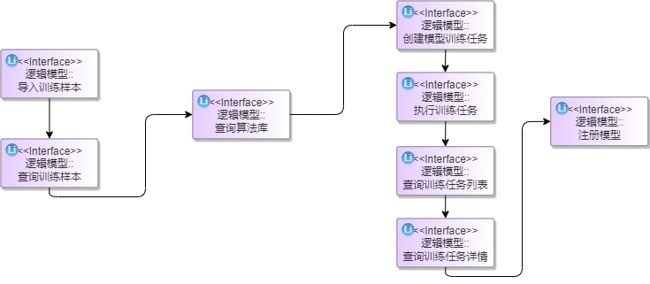

**（1）样本选择**

训练算法需要一定的样本，目前提供样本导入以及样本选择接口，这两个接口需要区分开，即用户只能选择导入的样本或者从原始数据中选取指定时间段的数据。

**（2）算法训练**

考虑到训练需要占用一定的资源及时间，这里选择在创建训练任务的时候，创建一个容器，在该容器内运行训练任务。训练任务完成后，支持训练结果的可视化。目前暂不支持训练任务进度的查询，只有完成与未完成的状态。当算法训练完成后，根据其结果可选择注册模型或者重新训练模型。


#### 3.2.2.2、UML图
#### 3.2.2.3、Story分解

| Story            | 说明 |
| ---------------- | ---- |
| 创建模型训练任务 |      |
| 执行训练任务     |      |
| 查询训练任务列表 |      |
| 查询训练任务详情 |      |
| 删除训练任务     |      |
| 注册模型         |      |
| 删除模型         |      |
| 加载模型         |      |
| 查询模型库       |      |
| 导入训练样本     |      |
| 创建训练样本     |      |
| 删除训练样本     |      |
| 查询训练样本     |      |

### 3.2.3、应用编排

#### 3.2.3.1、功能实现分析

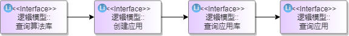

**（1）创建应用**

应用的编排主要由前端实现可视化交互功能，后端只需提供相应的组件以及定义应用的数据结构即可。按照约定，需要定义应用的名称、描述、每个组件的信息等。如下是一个应用数据结构的示例：

```json
{
    "id": "",
    "name": "",
    "version": "",
    "description": "",
    // 应用的调用方式，目前可以api、restful
    "api": {
        "type": "api",
        "address": ""
    },
    // 应用详情，一般分为几步
    "detail": [
        {
            "name": "单指标检测",
            // 表示该步骤是否启用
            "enabled": true,
            // 表示是否启用推荐模式
            "recommend": {
                "enabled": true
            },
            // 该步骤所使用的模型
            "param": {
                // 默认算法模型
                "default": {
                    "al_id": "",
                    "al_name": "",
                    "module_id": ""
                }
            }
        },
        {
            "name": "多指标检测",
            "enabled": true,
            "recommend": {
                "enabled": true
            },
            "param": {
                "default": {
                    "al_id": "",
                    "al_name": "",
                    "module_id": ""
                }
            }
        },
        {
            "name": "故障定位",
            "enabled": true,
            "recommend": {
                "enabled": true
            },
            "param": {
                "default": {
                    "al_id": "",
                    "al_name": "",
                    "module_id": ""
                }
            }
        }
    ]
}
```


**（2）默认网络诊断应用**

根据经验，该特性在网络场景下提供了一个内置的诊断应用模板，主要包含了单指标检测、多指标监测及根因定位三部分。其流程如下图所示，首先每个节点的时序数据经过单指标检测后，若判断有异常，则进行进一步的多指标综合检测，判断有异常后认为发生了异常。因为单指标检测容易误报，结合多指标检测能够提升检测的准确率。最后是根因定位阶段，主要是先根据拓扑图和各个节点异常事件进行相关性计算，划分出故障传播节点，得到故障传播图，再在每个故障传播图中进行因果分析，得到对应故障的根因节点和根因指标。

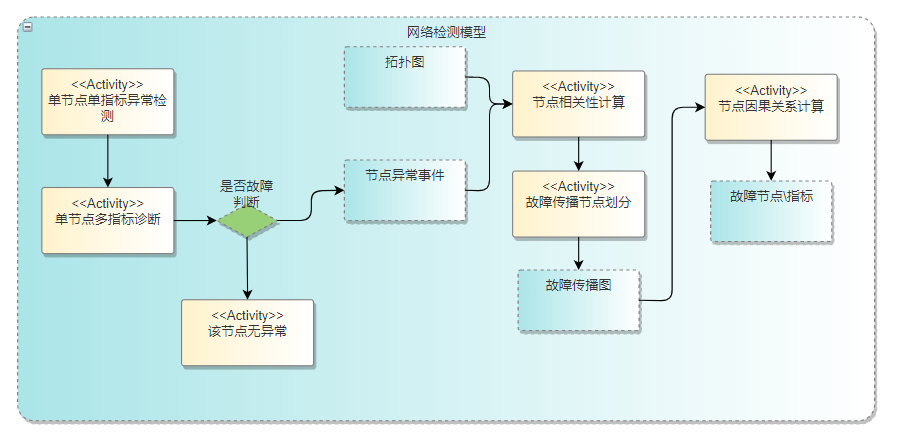


#### 3.2.3.2、UML图

#### 3.2.3.3、Story分解

| Story                    | 说明 |
| ------------------------ | ---- |
| 创建默认网络场景诊断应用 |      |
| 查询应用列表             |      |
| 查询应用                 |      |
| 创建应用                 |      |


## 3.3、检测管理

### 3.3.1 功能实现

**（1）定时检测**

- 模式一

工作流编排完成之后，选择启动工作流，此时检测模块会请求k8s服务拉起对应的检测节点。一个检测节点运行一个单独的工作流。首先向规则模块查询工作流，并解析工作流中的步骤与主机列表，然后查询工作流中所需要的算法与模型。在节点中启动定时任务，定时获取对应主机的数据，使用算法与模型进行检测。最终将检测的结果生成告警上报到告警模块。


- 模式二

该模式下，会自动根据配置场景选择相应的应用，创建工作流，解析工作流，随后开始启动定时检测任务，后续动作与模式一类似，不同的是最终结果直接发给kafka，整个过程产生的数据（工作流、检测结果）不会存储到数据库中。

**（2）工作流解析**

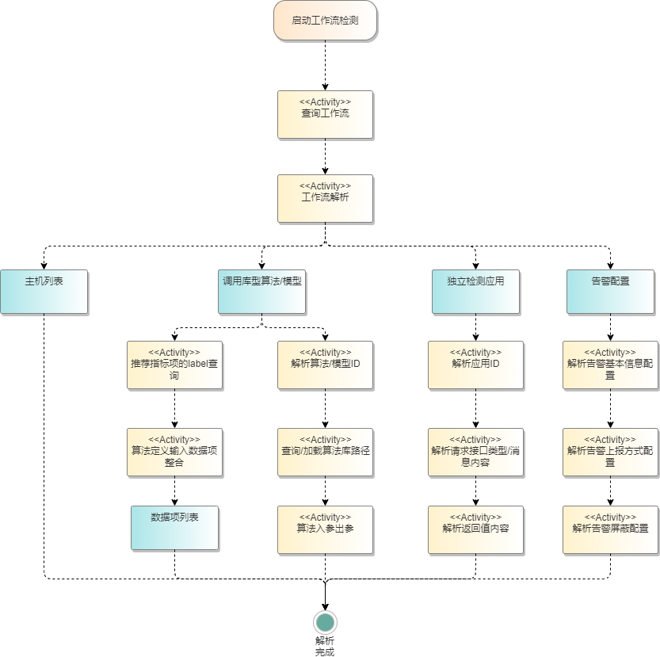

- 主机与数据项

  主要包含主机的ID，与该主机所需要数据项信息

  - 需要做单指标算法的指标项
  - 多指标算法与集群根因定位算法需要的指标项
  - 如果是包含数据采集服务的独立应用，则不描述数据指标项，只提供主机列表

- 算法与模型

  工作流中需要描述算法的ID与类型

  - 单指标算法
  - 多指标算法
  - 集群根因定位算法
  - 独立检测应用

- 步骤描述

  - 数据项输入

    - 算法的入参描述
    - 检测应用的消息接口
  - 算法列表
  - 输出信息

    - 算法返回值描述
    - 消息返回值描述/返回方式描述
  - 输出结果的告警描述

    - 告警信息描述
    - 告警上报方式
    - 告警屏蔽配置

**（3）模型/算法查询**

工作流解析之后，会得到算法ID与类型。针对调用库类型的算法与模型，需要根据算法/模型ID查询算法/模型库的模块加载路径，并加载完成。针对检测应用，需要查询他的服务消息接口。

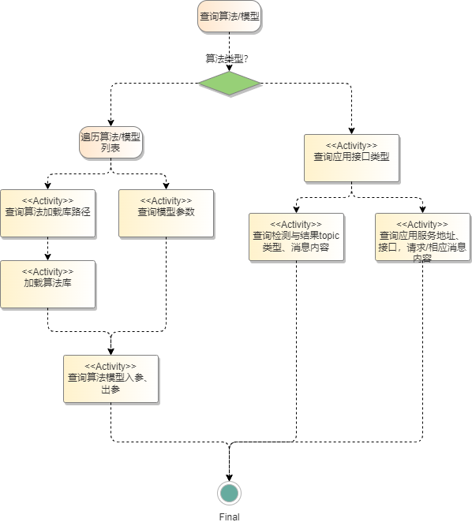

- 算法/模型查询加载

  

- 检测应用查询


**（4）数据查询**

数据查询主要分为日志与kpi两类数据。


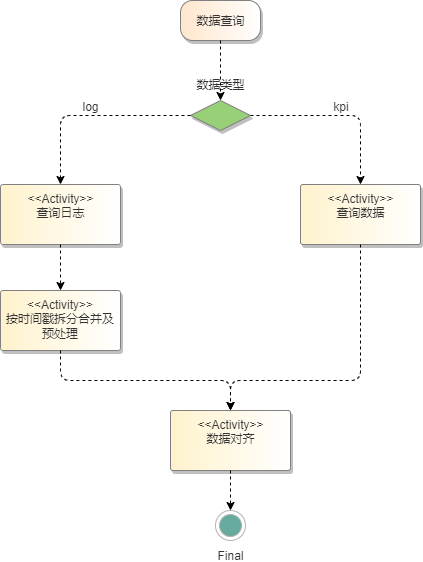


**（5）异常检测**

按照工作流中的步骤描述，执行异常检测。

针对调用库类型的算法，根据列表中的算法顺序与使能配置，获取数据，进行预处理，再逐个执行单指标算法、多指标算法、集群根因定位算法。

针对服务类的检测应用，则发送检测消息，由应用自行进行数据查询与检测动作，具体操作检测模块不感知，最终按工作流中描述的格式将检测结果返回。

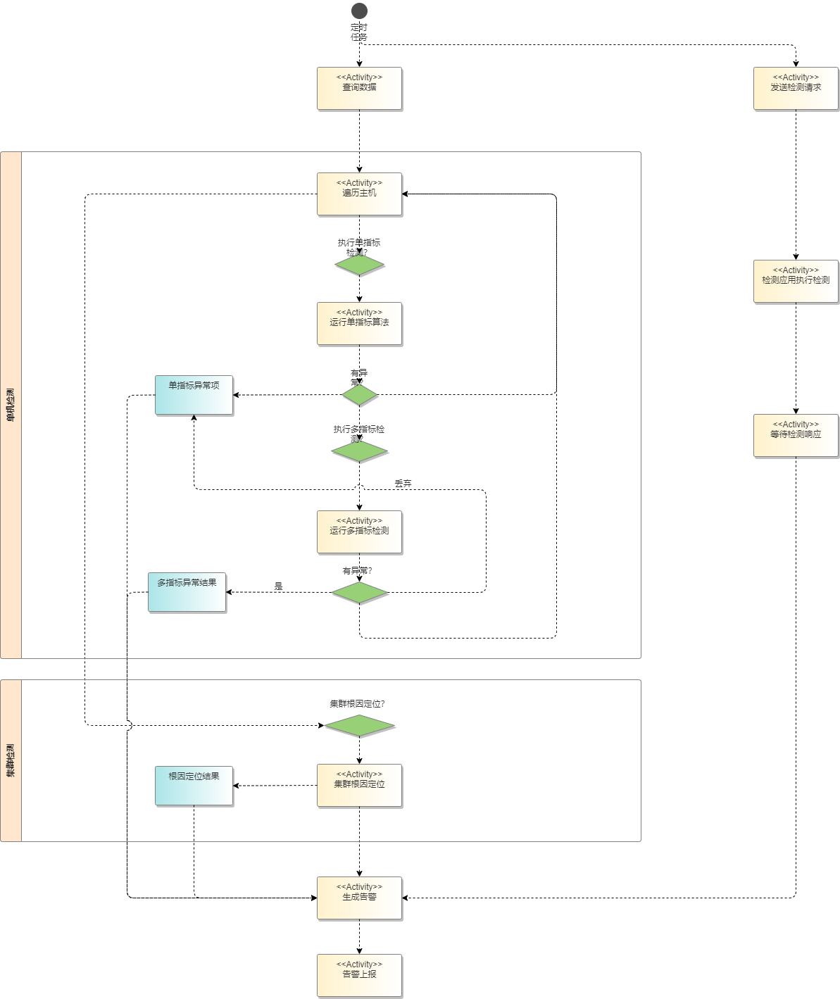

**（6）告警上报**

根据检测出的异常项生成告警并发送给告警模块。

| 名称         | 字段         | 说明                                                         |
| ------------ | ------------ | ------------------------------------------------------------ |
| 告警名称     | alert_name   | 工作流中描述检测出异常时需要上报的告警名称，此处按描述上报   |
| 告警ID       | alert_id     | 检测模块生成一个唯一的告警标识，之后可以用于告警的查询       |
| 告警流水号   | alert_seq    | 检测模块根据告警产生的顺序生成，用于在多个告警一起上报时标记顺序 |
| 告警级别     | alert_level  | 根据工作流中的描述上报                                       |
| 告警类型     | alert_type   | 根据工作流中的描述上报                                       |
| 定位信息     | alert_info   | 根据工作流中的描述上报                                       |
| 告警发生时间 | alert_time   | 根据被检测数据的时间上报                                     |
| 告警上报方式 | alert_method | 告警上报方式的描述信息。如短信上报，需要上报给哪些手机号；邮件上报，需要上报到哪些邮箱。 |
|              |              |                                                              |
|              |              |                                                              |

### 3.3.2 UML图


### 3.3.3 Story分解


## 3.4  故障告警

### 3.4.1 功能实现

**（1）告警上报**

告警模块接收到检测模块上报的告警时，可以根据用户配置（上报方式在工作流中描述）告警上报方式。告警模块根据告警描述的上报方式信息，选择对应的途径上报给对应的责任人。

- 短信上报
- 邮件上报


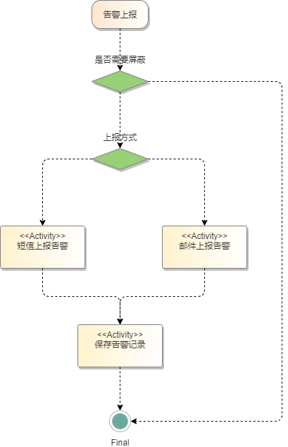

**（2）告警管理**

   告警模块需要提供告警的存储、查询、删除功能。
   
   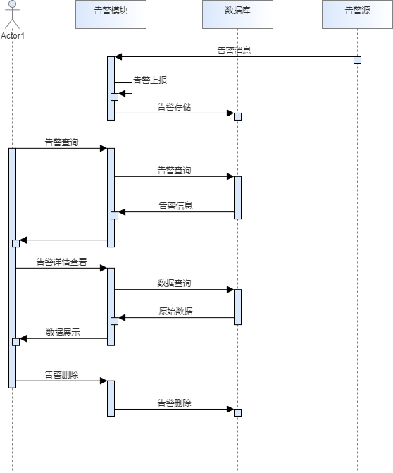

- 告警存储
- 列表查看
- 告警详情查看
- 告警删除


**（3）告警确认**

在WEB页面显示的告警，用户可以选择手动恢复，即表示这个告警已经人工确认了，则不再显示在告警中心页面中。用户也可以选择告警误报，即表示这条告警的检测有误，系统实际上未发生对应的告警，则系统会生成一个误报样本，用于训练提高检测算法的准确度。

- 手动恢复告警

- 告警误报确认

  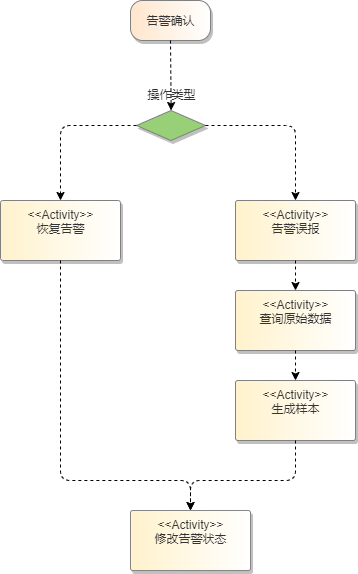


### 3.4.2 UML图


### 3.4.3 Story分解


# 4、质量属性设计

## 4.1、性能规格
| 规格名称 | 规格指标                                                     |
| :------- | :----------------------------------------------------------- |
| 内存占用 | 服务占用内存正在100M内，检测流程及训练流程均在新起的容器中执行。 |
| 启动时间 | 3s内启动                                                     |
| 响应时间 | 1-2秒内给出响应。一次检测视该工作流所覆盖的主机数量、监控指标数量而定，可以查询任务状态，接口并不阻塞。 |

## 4.2、可靠性设计

**1.异常情况**

该服务使用容器启动，容器终止后，可由k8s进行重启。

**2.集群部署**

若需要进行扩展，则只需增加pod，对外仍表现为一个service，内部由k8s进行负载均衡。

**3.数据库**

系统增加定时任务，在指定的时间段内，对系统中的数据做备份，默认保留最近1周的数据，便于后期恢复，该周期可配置 。

## 4.3、安全性设计

**1.数据库权限**

数据库统一对用户进行了区分，即用户只能访问其相关主机的信息。

**2.用户权限问题**

用户需要登录后获取到token，后续通过token来调用异常检测服务的接口，包括算法导入、训练、执行检测等，都与该登录用户关联。用户也会通过登录的token像manager服务获取到属于自己的主机，不具备访问其他用户主机的权限。

**3.文件权限问题**

 采用权限最小化策略，代码开发完成后补充相关文件的权限设计

**4.restful接口安全**

发送请求时使用token进行身份验证，使用https服务确保请求参数被加密，后端接收请求后对接口参数做每个参数类型的校验。

**5.命令注入问题**

命令行操作，入参会做校验，而且后台为解析参数后调用url接口，不存在入参拼接命令执行操作，所以不存在命令注入问题。

**6.威胁分析**


## 4.4、兼容性设计

1.服务对外接口使用restful接口，对外接口只能增量变化，新版本保证旧版本接口可用。

2.对于底层缓存，数据库的变更，对外不体现，由代码逻辑保证可用性。

## 4.5、可服务性设计

待考虑

## 4.6、可测试性设计

用户可通过构造故障进行测试

# 5、外部接口清单
[aops-diana接口文档.yaml](aops-diana接口文档.yaml)

# 6、数据库设计
[aops-diana数据库设计.sql](aops-diana数据库设计.sql)

# 7、修改日志

| 版本 | 发布说明             | 作者
| :--- | :------------------- | :-----|
| 1.0  | 异常检测特性设计文档，具备初步的检测框架，支持两种检测模式 | |
|      |                      | |


# 8、参考目录